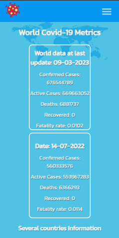
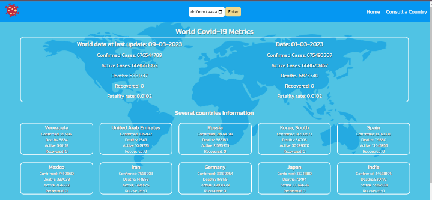
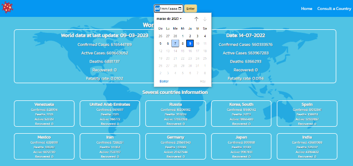
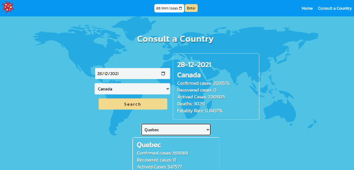

# 😎  Covid Metrics by Daniela Gonzalez & Eduardo Hernandez 😎

## Now! We are going to develop a web app to consult Covid metrics around the world, where you’ll can choose a country and a date to see details about infections

# Live Demo 🔗

### [Live Demo link Vercel ](https://covid-metrics-alpha.vercel.app/)

## Mobile view

## Desktop view

## Select a date and country/provinces

## The scope for this project is learn and built using:

### Vite
### ES6
### Typescript Modules
### Git workflow
### styled components
### React
### React Router
### Redux
### Jest
### Mock Service Worker

## Authors 🤯

- GitHub: [@danyhoshi](https://github.com/danyhoshi)
- GitHub: [@Edjhernandez](https://github.com/Edjhernandez)

## 🤝 Contributing

#### GitHub: [@hendridg](https://github.com/hendridg)
#### Contributions, issues, and feature requests are welcome!

## Show your support

Give a ⭐️ if you like this project!

## Acknowledgments

- Inspiration from teacher and partners

## 📝 License

This project is [MIT](./MIT.md) licensed.

